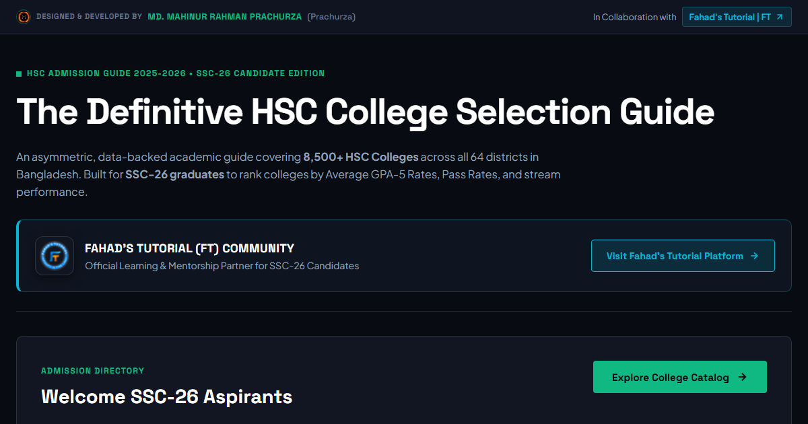

# 🎓 Bangladesh HSC College Selection Guide & Analytics Index

An editorial, high-performance web platform designed and owned by **MD. Mahinur Rahman Prachurza (Prachurza)** in collaboration with **Fahad's Tutorial (FT)** to help **SSC-26 Graduates and Parents in Bangladesh** discover, compare, and rank top **HSC Colleges** across all 64 districts in Bangladesh based on official Education Board Result Publication analytics.



---

## 👤 Owner & Creator Information

- **Project Owner & Lead Developer**: **MD. Mahinur Rahman Prachurza (Prachurza)**
- **Community & Learning Partner**: **[Fahad's Tutorial (FT)](https://ft.education/)**
- **Target Audience**: **SSC-26 Candidates**
- **Official Board Result Verification**: **[educationboardresults.gov.bd](https://www.educationboardresults.gov.bd/v2/home)** (HSC-25 Baseline).

---

## ✨ Key Features (v4.3 Edition)

- **Default Clean State**: No sorting priority is applied initially unless the user explicitly clicks a sort pill.
- **Reset Priority Button**: Clears all active sort priorities with 1 click to restore natural catalog order.
- **2-Click Multi-Sort Toggle Engine**: Click any metric pill once to turn it **ON** (add to priority ranks 1st, 2nd, 3rd) and click again to turn it **OFF**. 2 clicks maximum!
- **Human Non-AI Editorial Design**: Designed using **Space Grotesk** headings, sharp structural boundaries, high-contrast dark carbon theme, and zero emojis.
- **Fahad's Tutorial Marketing Callout**: Features a dedicated marketing card with direct links to [Fahad's Tutorial Platform](https://ft.education/).
- **Nationwide Coverage (8,500+ Audited Colleges)**: Complete coverage across all 11 Education Boards (Dhaka, Rajshahi, Chittagong, Comilla, Sylhet, Barisal, Dinajpur, Jessore, Mymensingh, Madrasah, Technical) in Bangladesh.

---

## 🛠️ Technology Stack

- **Frontend**: Vanilla HTML5, CSS3 (Custom Editorial Design System), JavaScript (ES6+ with `requestAnimationFrame` & Debouncing).
- **Data Source**: Official Bangladesh Education Board Result Publication Archives (`educationboardresults.gov.bd`).
- **No External Framework Dependencies**: Fast loading, zero-build step static web app ideal for GitHub Pages!

---

## 🚀 How to Sync Updates to GitHub Pages (3 Commands)

Run these 3 commands in Command Prompt or PowerShell inside your repository:

```bash
git add .
git commit -m "Fix preview image path, default un-sorted state, and reset priority button"
git push
```

GitHub Pages will automatically rebuild and update your site live within 30 seconds!
